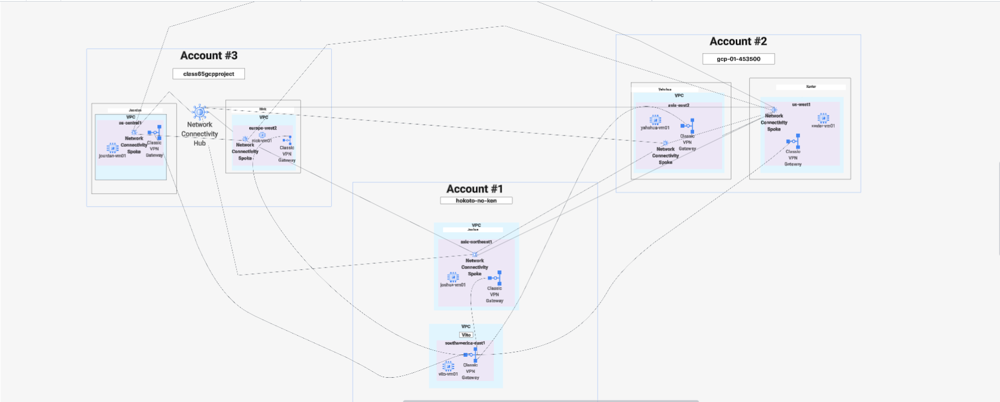

# gcp-armageddon-task-1

# Overview

This is our project for automating a portion of the Network Teams infrastructure as layed out in Task 1. This solution will enable the Network Team to connect to Balerica Inc. while also allowing the network team members to be easily connected with each other via the mesh topology network configuration.

We have leveraged several of GCP's cloud technologies such as their robust IAM and Admin services, the Network Connectivity Center, and the Classic VPN gateway using Terraform to automate the deployment of all of this infrastructure.

# Requirements 
The Network team is looking to automate a portion of their network infrastructure. 

In Terraform, build a classic (or HA) VPN connection that connects Balerica Inc. (GCP account) and your team (different GCP account). 

In addition, find a way to connect specific subnets from each team member to each other, creating a ring or similar topology between all participating group members and the VPN. 

Terraform code must also be accompanied by a network topology diagram, describing how team members are connected with each other, and how the team is connected with Balerica Inc. There must be a .tf file for each participating member's connections to Balerica Inc. and each other

# Diagram

# Provider, Backend, and IAM

To properly deploy this infrastructure, we must set up multiple providers for the accounts that will be used. You may add additional providers for more accounts to better reflect your development teams needs and environments. You must have a MINIMUM of 3 different GCP accounts to house all infrastructure.

