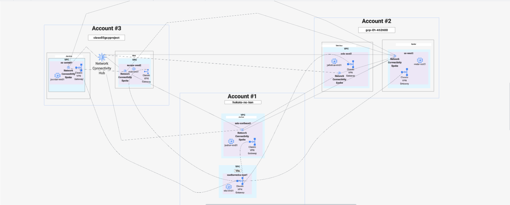

# gcp-armageddon-task-1

# Overview

This is our project for automating a portion of the Network Teams infrastructure as layed out in Task 1. This solution will enable the Network Team to connect to Balerica Inc. while also allowing the network team members to be easily connected with each other via the mesh topology network configuration.

We have leveraged several of GCP's cloud technologies such as their robust IAM and Admin services, the Network Connectivity Center, and the Classic VPN gateway using Terraform to automate the deployment of all of this infrastructure.


# Requirements 
The Network team is looking to automate a portion of their network infrastructure. 

In Terraform, build a classic (or HA) VPN connection that connects Balerica Inc. (GCP account) and your team (different GCP account). 

In addition, find a way to connect specific subnets from each team member to each other, creating a ring or similar topology between all participating group members and the VPN. 

Terraform code must also be accompanied by a network topology diagram, describing how team members are connected with each other, and how the team is connected with Balerica Inc. There must be a .tf file for each participating member's connections to Balerica Inc. and each other


# Diagram



## Prerequisites

Before you begin, ensure you have:

- [Terraform](https://www.terraform.io/downloads.html) v1.0+ installed
- [Google Cloud SDK](https://cloud.google.com/sdk/docs/install) installed and configured
- GCP Project with billing enabled
- Service Account with appropriate permissions
- `gcloud` CLI authenticated
- Generate preshared keys for your VPN gateways

### Required GCP APIs

Enable these APIs in your GCP projects:
```bash
gcloud services enable compute.googleapis.com
gcloud services enable cloudresourcemanager.googleapis.com
gcloud services enable iam.googleapis.com
gcloud services enable networkconnectivity.googleapis.com
gcloud services enable artifactregistry.googleapis.com
```

### Authentication Setup

```bash
# Authenticate with Google Cloud
gcloud auth login
gcloud config set project YOUR_PROJECT_ID

# Create terraform service account 
gcloud iam service-accounts create terraform-sa
gcloud projects add-iam-policy-binding YOUR_PROJECT_ID \
    --member="serviceAccount:terraform-sa@YOUR_PROJECT_ID.iam.gserviceaccount.com" \
    --role="roles/editor"

# Add necessary iam roles
gcloud projects add-iam-policy-binding YOUR_PROJECT_ID \
    --member="serviceAccount:terraform-sa@YOUR_PROJECT_ID.iam.gserviceaccount.com" \
    --role="roles/storage.admin"

gcloud projects add-iam-policy-binding YOUR_PROJECT_ID \
    --member="serviceAccount:terraform-sa@YOUR_PROJECT_ID.iam.gserviceaccount.com" \
    --role="roles/artifactregistry.admin"    

gcloud projects add-iam-policy-binding YOUR_PROJECT_ID \
    --member="serviceAccount:terraform-sa@YOUR_PROJECT_ID.iam.gserviceaccount.com" \
    --role="roles/networkconnectivity.hubAdmin"    

# Create json key for terraform service account
gcloud iam service-accounts keys create KEY_FILE_PATH --iam-account=SERVICE_ACCOUNT_EMAIL

# Activate terraform service account
gcloud auth activate-service-account [SERVICE_ACCOUNT_EMAIL] --key-file=[KEY_FILE_PATH]


# Create a Google Cloud Storage bucket to store terraform state file, utilizing best practices

gcloud storage buckets create gs://BUCKET_NAME --project=PROJECT_ID --default-storage-class=STORAGE_CLASS --location=BUCKET_LOCATION --uniform-bucket-level-access
--soft-delete-duration=RETENTION_DURATION

```

You will also need the json keys for your other team members terraform service accounts in order to authenticate
with the different providers.

For the current configuration you only need 3 json keys. However, depending on the size of your team and how you want to divvy up the accounts, you may need additional json keys.


# Provider

In file 0-a we have set up the providers for the different accounts we will be creating resources in.

For the current configuration you must have a MINIMUM of 3 accounts to be set as providers

You may add more providers as needed if you wish to have each team members account be its own provider

Ex. custom.tf will have its own providere.providernamehere.tf will have its own provider etc.

This is how the providers need to be set up

```terraform 

provider "google" {
  project     = "project-name"
  region      = "region-name"
  credentials = "gcp-terraform-sa-credentials.json"
  alias       = "alias-name-here"
}

```

Account Number 1 will house all resources created in files 2 and 4

Account Number 2 will house all resources created in files 5a and 5b

Account Number 3 will house all resources created in files 3a, 3b, and 6

The providers must have an alias such that we are able to seperate terraform resources into different accounts and projects

Feel free to change what accounts will house what resources as you desire


# Backend

In file 0-b we have a backend storage bucket with a required provider version for hashicorp/google

Change the json credentials as needed to align with your terraform service account that you have set up in Authentication Setup

Change version to latest if need be

```terraform 
terraform {
  backend "gcs" {
    bucket      = "name-of-bucket"
    prefix      = "terraform/state"
    credentials = "gcp-terraform-sa-credentials.json"
  }

  required_providers {
    google = {
      source  = "hashicorp/google"
      version = "~> 6.0"
    }
  }
}
```


# IAM 

In order for the other accounts to create Network Connectivity Center spokes in their respective projects we need to add the terraform service accounts as iam members in the project residing in Account 3

These iam members must have the same roles as the terraform service account that you created, with the exception of the editor role

```terraform

resource "google_project_iam_member" "account-1-member" {
  project  = "project-name"
  for_each = var.sa-roles
  role     = each.value
  member   = "serviceAccount:terraform-sa@ACCOUNT_1_PROJECT_ID.iam.gserviceaccount.com"
}

resource "google_project_iam_member" "account-2-member" {
  project  = "project-name"
  for_each = var.sa-roles
  role     = each.value
  member   = "serviceAccount:terraform-sa@ACCOUNT_2_PROJECT_ID.iam.gserviceaccount.com"
}

resource "google_project_iam_binding" "project" {
  project  = "project-name"
  for_each = var.sa-roles
  role     = each.value

  members = [
    "serviceAccount:terraform-sa@ACCOUNT_1_PROJECT_ID.iam.gserviceaccount.com", 
    "serviceAccount:terraform-sa@ACCOUNT_2_PROJECT_ID.iam.gserviceaccount.com"
  ]
}

```


# Files 2-5b

Each file creates a custom VPC with a custom subnet that has a unique CIDR range, firewall rules that allow port 22 SSH and ICMP ping, a network connectivity spoke, a static IP for the classic VPN gateway, a classic VPN gateway with ESP and UDP forwarding rules, VPN tunnels and VPN tunnel routes. 

File 2 has multiple tunnels and routes as files 3a-5b are connecting to Balerica via the VPN gateways. Please keep this in mind when adding more accounts to this project. If you don't add the corresponding tunnels and routes, this will not work.


```terraform
resource "google_compute_network" "custom_vpc" {
  name                            = "custom-vpc"
  routing_mode                    = "REGIONAL"
  auto_create_subnetworks         = false
  mtu                             = 1460
  delete_default_routes_on_create = false
  provider                        = google.providernamehere
}

resource "google_compute_subnetwork" "custom_subnet" {
  name                     = "custom-subnet"
  ip_cidr_range            = "10.0.0.0/24"  # Custom CIDR range here
  region                   = "insert-regionhere"
  network                  = google_compute_network.custom_vpc.id
  private_ip_google_access = true
  provider                 = google.providernamehere
}

resource "google_compute_firewall" "custom-allow-ssh" {
  name     = "custom-allow-ssh"
  network  = google_compute_network.custom_vpc.name
  provider = google.providernamehere
  allow {
    protocol = "tcp"
    ports    = ["22"]
  }

  source_ranges = ["0.0.0.0/0"]
}

resource "google_compute_firewall" "custom-allow-icmp" {
  name     = "custom-allow-icmp"
  network  = google_compute_network.custom_vpc.name
  provider = google.providernamehere
  allow {
    protocol = "icmp"
  }

  source_ranges = ["0.0.0.0/0"]
}

resource "google_network_connectivity_spoke" "custom_spoke" {
  name        = "custom-spoke"
  location    = "global"
  description = "Spoke for custom vpc mesh"
  hub         = google_network_connectivity_hub.team_mesh.id
  provider    = google.providernamehere
  linked_vpc_network {
    uri = google_compute_network.custom_vpc.self_link
  }
  depends_on = [google_network_connectivity_group.team_group]
}

resource "google_compute_vpn_gateway" "custom_target_gateway" {
  name     = "custom-vpn"
  network  = google_compute_network.custom_vpc.id
  provider = google.providernamehere
  region   = "insert-regionhere"
}

resource "google_compute_address" "custom_vpn_static_ip" {
  name       = "custom-vpn-static-ip"
  provider   = google.providernamehere
  region     = "insert-regionhere"
  depends_on = [google_compute_network.custom_vpc]
}

resource "google_compute_forwarding_rule" "custom_fr_esp" {
  name        = "custom-fr-esp"
  ip_protocol = "ESP"
  ip_address  = google_compute_address.custom_vpn_static_ip.address
  target      = google_compute_vpn_gateway.custom_target_gateway.id
  region      = "insert-regionhere"
  provider    = google.providernamehere
}

resource "google_compute_forwarding_rule" "custom_fr_udp500" {
  name        = "custom-fr-udp500"
  ip_protocol = "UDP"
  port_range  = "500"
  ip_address  = google_compute_address.custom_vpn_static_ip.address
  target      = google_compute_vpn_gateway.custom_target_gateway.id
  region      = "insert-regionhere"
  provider    = google.providernamehere
}

resource "google_compute_forwarding_rule" "custom_fr_udp4500" {
  name        = "custom-fr-udp4500"
  ip_protocol = "UDP"
  port_range  = "4500"
  ip_address  = google_compute_address.custom_vpn_static_ip.address
  target      = google_compute_vpn_gateway.custom_target_gateway.id
  region      = "insert-regionhere"
  provider    = google.providernamehere
}

resource "google_compute_vpn_tunnel" "custom_tunnel" {
  name          = "custom-tunnel"
  peer_ip       = google_compute_address.vito_balerica_vpn_static_ip.address
  shared_secret = var.custom_vpn_shared_secret
  provider      = google.providernamehere

  target_vpn_gateway = google_compute_vpn_gateway.custom_target_gateway.id
  region             = "insert-regionhere"

  local_traffic_selector  = ["10.0.0.0/24"] # custom's subnet  # Custom subnet CIDR Range goes here
  remote_traffic_selector = ["10.0.1.0/24"] # Balerica's subnet # Custom CIDR range for Balerica goes here

  depends_on = [
    google_compute_forwarding_rule.custom_fr_esp,
    google_compute_forwarding_rule.custom_fr_udp500,
    google_compute_forwarding_rule.custom_fr_udp4500,
  ]
}

resource "google_compute_route" "custom_to_balerica_route" {
  name       = "custom-to-balerica-route"
  network    = google_compute_network.custom_vpc.name
  dest_range = "10.0.1.0/24"      # Custom CIDR range for Balerica goes here
  priority   = 1000
  provider   = google.providernamehere

  next_hop_vpn_tunnel = google_compute_vpn_tunnel.custom_tunnel.id
}
```

# Team NCC

The Network Connectivity Hub is what will allow the different accounts to be connected with each other. The different account projects are put together in a group and are automatically accepted into the team mesh. Each account must have their own spoke to be able to connect to the network connectivity hub.

```terraform
# The team Network Connectivity Center for team connecting to Balerica
resource "google_network_connectivity_hub" "team_mesh" {
  name        = "team-mesh"
  description = "Team mesh for vpcs"
  provider    = google.providernamehere
}


resource "google_network_connectivity_group" "team_group"  {
 hub         = google_network_connectivity_hub.team_mesh.id 
 name        = "default"
 description = "A sample hub group"
 provider    = google.providernamehere
 auto_accept {
    auto_accept_projects = [
      "account-1projectname", 
      "account-2projectname", 
      "account-3projectname"
    ]
  }
  depends_on = [google_network_connectivity_hub.team_mesh]
}
```

# Variables and secrets

In the variables file, we have variables for the vpn shared keys, and the iam roles which will be assigned to the other accounts terraform service iam member.

```terraform 
variable "balerica_vpn_shared_secret" {}
variable "member1_vpn_shared_secret" {}
variable "member2_vpn_shared_secret" {}
variable "member3_vpn_shared_secret" {}
variable "member4_vpn_shared_secret" {}
variable "member5_vpn_shared_secret" {}


variable "sa-roles" {
  type    = set(string)
  default = ["roles/storage.admin", "roles/artifactregistry.admin", "roles/networkconnectivity.hubAdmin"]
}
```

These roles will allow the other terraform service accounts to provision and manage the created infrastructure, and store the configuration in the statefile within the backend configured in file 0-b

Create a shell script to export terraform variables for your VPN preshared keys
https://jemnetworks.com/psk#pskSection

```bash
export TF_VAR_balerica_vpn_shared_secret=24characterkeyhere
export TF_VAR_member1_vpn_shared_secret=24characterkeyhere
export TF_VAR_member2_vpn_shared_secret=24characterkeyhere
export TF_VAR_member3_vpn_shared_secret=24characterkeyhere
export TF_VAR_member4_vpn_shared_secret=24characterkeyhere
export TF_VAR_member5_vpn_shared_secret=24characterkeyhere
```

Add a terraform.tfvars file but leave it empty.


# Deployment
Source the shell script file to export the terraform variables 

```bash
source ./nameofshfile.sh
```

Execute the corresponding terraform commands to deploy the infrastructure 
```bash 
# Initialize, validate configuration, and plan
terraform init
terraform validate
terraform plan

# Apply changes
terraform apply

# Destroy infrastructure
terraform destroy

#Check current state
terraform show
terraform state list
```


# Troubleshooting


